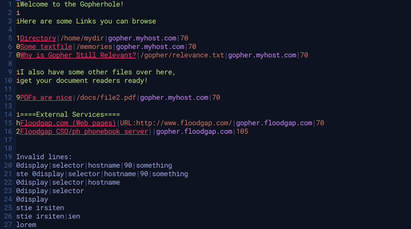

# vim-gopher-syntax

Gopher (Protocol) Syntax Highlighting for Vim

This plugin provideds syntax highlighting for gophermaps. 
Any file with the `.gph` suffix and any file called `gophermap` will be treated as a gophermap.
